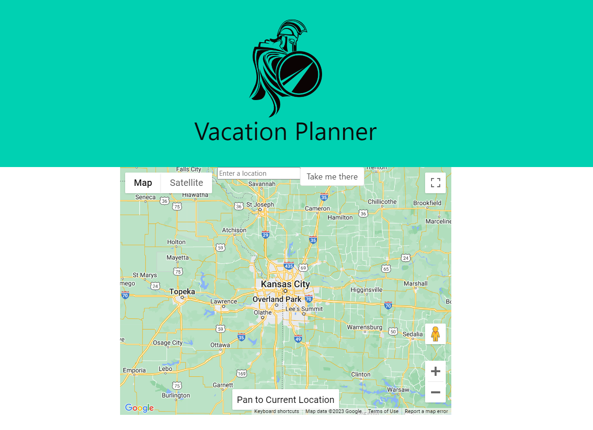

# <The Vacation Planner>

## Description

Planning a vacation can be a hassle- The Vacation Planner allows a user to:
Find a destination & visualize it on a map 	✈
Select dates of travel 	📅
View weather forecasts and weather history for the selected travel dates ⛈
So, in other words: Vacations simplified!

- What was your motivation?
We wanted to enable users to quickly plan a simple trip- the inspiration came from our very own Matin who was traveling back from Costa Rica as we came up with ideas.

- What problem does it solve?
The Vacation Planner solves the headache of having to use multiple websites to pull up the most important elements of travel: location, date, and weather.

- What did you learn?

Technologies Used: Bulma, HERE Maps API, Google Maps API
Breakdown of Tasks: 
Eli - Map API, implementing the map and searching for locations
Connor - Weather API, implementing weather queries
Steven - Front end
Matin - Front end
Challenges: 
Learning Bulma 
complexity with the HERE platform - not just one simple API call, but multiple calls to multiple different APIs
API security credentials
CORS errors 
Teammate challenges
Successes: Getting Google maps to function, implementing search and geocoding. Discovered local development server. Using Bulma for front end. Github practice & workflow.

## Usage

## Credits

List your collaborators, if any, with links to their GitHub profiles.
Eli Pruneda - Scorch87 https://github.com/Scorch87
Matin Tavacoli - mtavacoli https://github.com/mtavacoli
Steven Chapin - SChafinIII https://github.com/SChafinIII

If you followed tutorials, include links to those here as well.
Google Maps API
https://developers.google.com/maps/documentation/javascript/tutorials
